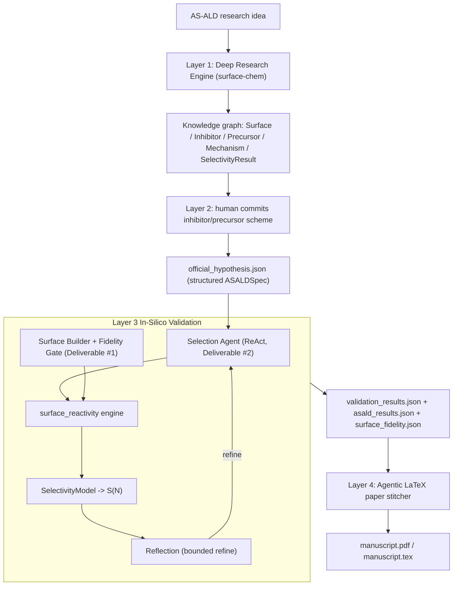

# AS-ALD Co-Scientist — Layers 1–4

An autonomous in-silico co-scientist for **area-selective atomic layer deposition
(AS-ALD)**. It turns a surface-chemistry research idea into ranked, literature-grounded
intervention hypotheses, lets a human commit one inhibitor/precursor scheme, validates the
selectivity claim computationally on experiment-faithful amorphous surfaces, and then
autonomously stitches a reproducible LaTeX manuscript of the result.

Target problem (Merck KGaA 2026 Innovation Cup, Challenge 4): *passivate SiN, deposit
SiOₓ-on-SiOₓ at ≥90 % selectivity at 10 nm oxide (3D-NAND cell isolation).*



## The two graded deliverables

1. **Amorphous surface builder** (`surfaces/`, ADR-003) — a melt-quench-cleave-saturate-
   condense pipeline with an explicit *target site density* and a *fidelity gate* that
   rejects any slab outside the experimental band (SiO₂ 0.35–2.5 OH/nm², Zhuravlev ~1.15;
   SiN 1.0–6.0 –NH/nm²). It generates an *ensemble* of N slabs per condition so selectivity
   is reported as a distribution, not a fragile point estimate.
2. **Agentic inhibitor/precursor selection** (`validation/designer.py`, ADR-005) — a ReAct
   selection agent that retrieves candidates from the knowledge graph, ranks them against a
   human-editable [`selection_criteria.md`](selection_criteria.md), and feeds the chosen
   pair into the validation loop (which can refine to another pair via the Reflection agent).

## Compute tiers (runs on a laptop or Colab)

| Tier | Where | What runs |
| --- | --- | --- |
| **0** (default) | anywhere, no GPU (M4 Pro native) | fidelity gate + coverage + `SelectivityModel` + verdict, using literature/xTB adsorption-energy priors from `selection_criteria.md` |
| **1** | Colab CUDA / CPU | foundation MLIP (`mace_mp(model="medium")`) computes adsorption energies (and optional NEB barriers) |
| **2** | optional | xTB / small-DFT spot-checks to anchor Tier-1; reported as a `calibration_vs_literature` validity flag |

Set the tier via `COMPUTE_TIER` (0/1/2). MACE energy differences require float64, which the
Apple **MPS** backend does not support, so on the M4 Pro the MLIP tier runs on CPU while
Tier-0 stays interactive; `MLIP_DEVICE=auto` resolves to CUDA on Colab.

## Setup

```bash
python3.12 -m venv .venv
source .venv/bin/activate
pip install -e ".[openai]"          # Tier-0 + Layer 4 figures
# Optional Tier-1 (foundation MLIP): pip install -e ".[mlip]"
# Optional Tier-2 (xTB calibration): pip install -e ".[xtb]"
cp .env.example .env                # then set your LLM provider + key (optional; --offline works keyless)
```

The LLM is provider-agnostic via langchain's `init_chat_model` (`LLM_PROVIDER`/`LLM_MODEL`).
Every stage has a deterministic offline fallback, so the full funnel runs with no key.

## Usage

```bash
# Layers 1-2: literature research + human hypothesis commitment
aicoscientist --idea "passivate a-SiN, grow SiOx-on-a-SiO2 to 90% selectivity at 10 nm" \
              --offline --run-id demo --auto select:1

# Layer 3: in-silico surface-reactivity validation (Tier-0 by default)
aicoscientist-validate --run-id demo --offline

# Layer 4: stitch the reproducible manuscript
aicoscientist-paper --run-id demo
```

Interactive Layer 2 actions: `select <n>`, `modify <n>`, `merge <n,m>`, `new`, `quit`.
For Tier-1 reactivity: `COMPUTE_TIER=1 aicoscientist-validate --run-id demo`.

## In-silico testing protocol (ADR-009)

For the committed hypothesis the `surface_reactivity` engine records every intermediate to
`asald_results.json`:

1. **Build & gate surfaces** — N a-SiO₂ (GS) and N a-SiN (NGS) slabs; discard gate failures.
2. **Inhibitor adsorption screen** — `dE_ads = E(slab+mol) − E(slab) − E(mol_gas)` on GS vs
   NGS (chemisorb on NGS ≲ −0.7 eV, physisorb on GS ≳ −0.3 eV).
3. **Effective blocking coverage** — only chemisorbed, purge-surviving inhibitor blocks the
   precursor; the differential `θ_block(NGS) − θ_block(GS)` drives selectivity.
4. **[Tier-2, optional] precursor barrier** — NEB lower bound, calibrated vs literature DFT.
5. **Selectivity & verdict** — differential blocking → nucleation delay → `S(N)`, reported as
   mean ± std at the target thickness with a supported / partially-supported / rejected verdict.

The verified worked example (carboxylic-acid SMI on a-SiN, BDEAS on a-SiO₂) yields
differential blocking ≈ 0.94 and **S ≈ 0.92 at 10 nm → supported**.

## Output artifacts (`artifacts/<run_id>/`)

Layers 1–2: `knowledge_graph.json`/`.graphml`, `citation_repository.json` (real DOIs),
`hypothesis_state_graphs.json`, `research_provenance.json`, `confidence_scores.json`,
`official_hypothesis.json` (with the structured `ASALDSpec`).

Layer 3: `validation_plan.json`, `validation_results.json`, `asald_results.json` (the
paper-ready protocol output), `surface_fidelity.json`, `simulation_logs/`, updated KG with
`validation_result:*` nodes.

Layer 4: `manuscript/manuscript.tex` (+ `manuscript.pdf` when a TeX toolchain is present)
and `manuscript/selectivity.png`. Every number and citation is pulled from the artifacts —
nothing is invented.

## Reproducibility (ADR-008)

Seeds, engine/tier, MLIP model + device, temperature, ensemble size, and surface-generation
parameters are logged into `asald_results.json` / `surface_fidelity.json`. A CPU
[`Dockerfile`](Dockerfile) and a locked [`environment.yml`](environment.yml) reproduce the
Tier-0 funnel end-to-end (`docker build -t asald . && docker run --rm asald`).

## Project layout

```
src/aicoscientist/
  config.py              # env-driven settings (incl. MLIP tier/model/device)
  models.py              # pydantic artifacts (incl. ASALDSpec, SurfaceFidelityReport)
  asald.py               # derive ASALDSpec from a committed hypothesis
  knowledge_graph.py     # networkx KG: provenance, merge, dedup
  sources/               # arxiv/openalex/crossref/pubmed/semantic_scholar + seed_asald + mock
  agents/                # orchestrator, research_agent, hypothesis_agent (surface-chem)
  surfaces/              # Deliverable #1: amorphous_builder, fidelity_gate, descriptors
  validation/            # Layer 3
    designer.py          # Deliverable #2: ReAct inhibitor/precursor selection agent
    reflection.py        # bounded closed-loop refinement
    surface_reactivity.py# ADR-004/009 protocol engine
    selectivity_model.py # ADR-006 nucleation-delay -> S(N)
    mlip.py              # Tier-1 foundation-MLIP hooks (ASE/MACE)
    registry.py / runner.py
  layer4_paper/          # ADR-007: template.tex, sections, figures, compiler, stitcher
  layer1_graph.py / layer2_graph.py / layer3_graph.py / graph.py
  cli.py / cli_validate.py / cli_paper.py
selection_criteria.md    # human-editable selection criteria + candidate library
```

## Methodology references

Parsons & Clark, Chem. Mater. 2020 (ASD review) · Tezsevin et al., Langmuir 2023 (aniline
SMI) · MSA inhibitor, Chem. Mater. 2024 · dehydroxylated silica slabs, PCCP 2025 · MLIP
barrier underestimation, arXiv:2502.15582 · Seal et al., arXiv:2510.27130 (Supervisor /
Swarm / ReAct / Reflection).
