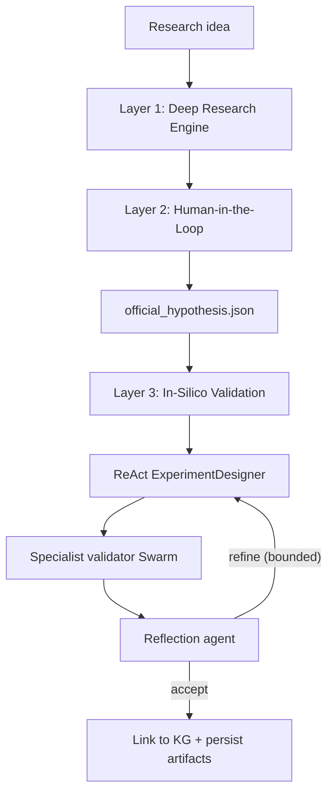

# AI Co-Scientist — Layers 1, 2 & 3

An autonomous research assistant that turns a research idea into a set of ranked,
evidence-backed scientific hypotheses, lets a human researcher choose the official
direction, then computationally validates that hypothesis before any physical experiment.

This repository implements the first three layers of the AI Co-Scientist architecture:

- **Layer 1 — Deep Research Engine.** A swarm of domain-specialized research agents
  searches real scholarly literature, extracts concepts into a unified **knowledge
  graph** with full citation provenance, and generates multiple competing hypotheses.
  Each hypothesis gets its own **Hypothesis State Graph** (supporting evidence,
  contradicting evidence, assumptions, confidence, references). A parent orchestration
  agent merges the per-domain graphs, removes duplicates, and ranks the hypotheses.
- **Layer 2 — Human-in-the-Loop Scientific Reasoning.** The pipeline pauses on a
  LangGraph `interrupt`, presents the five highest-ranked hypotheses in an interactive
  CLI, and lets the researcher select / modify / merge / add a new insight / reject all
  and redirect. The decision is captured as structured data and saved as the official
  research hypothesis.
- **Layer 3 — In-Silico Validation.** A standalone stage loads the approved hypothesis,
  designs a concrete computational test via a ReAct experiment designer, runs a real
  validation engine from a Swarm of specialist agents, and produces a quantitative
  verdict (supported / partially supported / rejected). A Reflection agent can trigger
  a bounded closed-loop refinement before finalizing. Results are linked back into the
  knowledge graph for full traceability.



## Scholarly sources (all free)

Layer 1 queries five literature sources and merges the results. Four need **no API
key**; Semantic Scholar works without a key but is rate-limited (set an optional key
to raise limits):

| Source | Key required | Corpus |
| --- | --- | --- |
| arXiv | No | Preprints (AI/ML, physics, math, CS) |
| OpenAlex | No | 250M+ scholarly works |
| Crossref | No | 150M+ works, DOIs, citation counts |
| PubMed (NIH E-utilities) | No | 36M+ biomedical papers |
| Semantic Scholar | Optional | Cross-domain graph |

Each source failure degrades gracefully — a run never hard-fails because one API is
down or rate-limited.

## Setup

```bash
python3.12 -m venv .venv
source .venv/bin/activate
pip install -r requirements.txt
cp .env.example .env   # then edit .env with your LLM provider + key
```

The LLM is provider-agnostic via langchain's `init_chat_model`. Configure it in `.env`:

```bash
LLM_PROVIDER=openai
LLM_MODEL=gpt-4o-mini
OPENAI_API_KEY=sk-...
```

Swap to Anthropic, Ollama, etc. by changing `LLM_PROVIDER` / `LLM_MODEL`.

## Usage

### Layers 1 & 2 — research + human review

```bash
# Full run against live scholarly APIs (needs an LLM key)
python -m aicoscientist.cli --idea "Repurposing metformin for cancer prevention"

# Fast offline smoke test: stubbed sources + deterministic heuristics,
# no network or API key needed
python -m aicoscientist.cli --idea "test idea" --offline
```

The CLI runs Layer 1, then pauses and shows the top-5 hypotheses. Pick an action:

- `select <n>` — accept hypothesis *n* as-is
- `modify <n>` — accept *n* with an edited statement
- `merge <n,m,...>` — combine several hypotheses into one
- `new` — reject all and supply a fresh research direction
- `quit` — abort without choosing

### Layer 3 — in-silico validation

After a Layer 1–2 run completes, validate the approved hypothesis:

```bash
# Validate a completed run (offline = deterministic designer/reflection, real engines)
aicoscientist-validate --run-id <run_id> --offline

# With LLM-assisted experiment design and reflection
aicoscientist-validate --run-id <run_id> --verbose
```

Example workflow:

```bash
aicoscientist --idea "Repurposing metformin as a cancer inhibitor" --offline --run-id demo --auto "select:1"
aicoscientist-validate --run-id demo --offline --verbose
```

## Layer 3 — validation Swarm

Layer 3 uses an agentic closed loop (Supervisor + Swarm + ReAct + Reflection) per
[Seal et al., arXiv:2510.27130](https://arxiv.org/abs/2510.27130). The experiment
designer (ReAct) picks a domain and parameters; a specialist validator runs real
computation; the Reflection agent critiques the result and may trigger a bounded
re-design (`MAX_VALIDATION_ITERS`, default 2) before finalizing.

| Domain | Engine | Reference |
| --- | --- | --- |
| `statistical` | statsmodels / scipy / scikit-learn (regression, t-test, effect sizes) | — |
| `cheminformatics` | RDKit (QED, Lipinski, PAINS/Brenk, Tanimoto similarity) | arXiv:2510.27130 |
| `mechanistic` | scipy ODE integration (PK-PD, pathway dynamics, digital-twin style) | — |
| `drug_repurposing` | DrugPipe two-phase: RDKit candidate generation → similarity vs drug library → ADMET → docking proxy | [DrugPipe](https://github.com/HySonLab/DrugPipe) |
| `structure_based_design` | DiffSBDD interface + deterministic stub; [Colab notebook](https://colab.research.google.com/github/arneschneuing/DiffSBDD/blob/main/colab/DiffSBDD.ipynb) for real SBDD | [arXiv:2210.13695](https://arxiv.org/abs/2210.13695) |
| `protein` | Alias → `structure_based_design` | — |

The designer routes hypotheses automatically by keyword (e.g. "repurpos" →
`drug_repurposing`, "pocket" / "SBDD" → `structure_based_design`).

Optional: set `DIFFSBDD_PATH` in `.env` to point at a local DiffSBDD install for real
structure-based ligand generation (requires GPU + model weights).

## Output artifacts

Every Layer 1–2 run writes to `artifacts/<run_id>/`:

- `knowledge_graph.json` / `knowledge_graph.graphml` — the unified knowledge graph
- `knowledge_graph_metadata.json` — counts, domains, density
- `citation_repository.json` — every cited source with provenance
- `hypothesis_state_graphs.json` — all hypotheses with evidence/assumptions/confidence
- `research_provenance.json` — domains, sources queried, reasoning trace
- `confidence_scores.json` — per-hypothesis ranking scores
- `official_hypothesis.json` — the researcher's Layer 2 decision (written after the interrupt)

Layer 3 adds (same directory):

- `validation_plan.json` — the designed in-silico experiment
- `validation_results.json` — final verdict, metrics, iteration history, reflections
- `validation_provenance.json` — loop trace + methodology citations
- `datasets/` — input data analyzed (CSV/JSON per validator)
- `simulation_logs/` — raw engine outputs and parameters
- Updated `knowledge_graph.json` with `validation_result:*` nodes linked via `evidence_for` edges

## Project layout

```
src/aicoscientist/
  config.py              # env-driven settings
  llm.py                 # provider-agnostic LLM + structured output
  models.py              # pydantic artifacts (Layers 1–3)
  knowledge_graph.py     # networkx KG: provenance, merge, dedup, serialize
  sources/               # arxiv, openalex, crossref, pubmed, semantic_scholar
  agents/                # orchestrator, research_agent, hypothesis_agent
  validation/            # Layer 3 specialist validators
    designer.py          # ReAct experiment designer
    reflection.py        # Reflection agent (closed-loop)
    statistical.py       # statsmodels/scipy real computation
    cheminformatics.py   # RDKit ADMET/drug-likeness
    mechanistic.py       # scipy ODE simulation
    drug_repurposing.py  # DrugPipe two-phase repurposing
    structure_based_design.py
    backends/diffsbdd.py # DiffSBDD interface + stub
    registry.py          # Supervisor routing table
    runner.py            # Layer 3 entry point
  layer1_graph.py        # Layer 1 LangGraph (parallel swarm fan-out)
  layer2_graph.py        # Layer 2 interrupt + decision application
  layer3_graph.py        # Layer 3 bounded validation loop
  graph.py               # L1+L2 combined graph with SqliteSaver
  persistence.py         # per-run artifact store
  cli.py                 # Layers 1–2 entry point
  cli_validate.py        # Layer 3 entry point (aicoscientist-validate)
data/
  drugbank_mini.csv      # reference drug library for repurposing validation
```

## Methodology references

- Seal et al., *AI Agents in Drug Discovery*, [arXiv:2510.27130](https://arxiv.org/abs/2510.27130) — agentic architecture (Supervisor, Swarm, ReAct, Reflection)
- Pham et al., *DrugPipe*, [github.com/HySonLab/DrugPipe](https://github.com/HySonLab/DrugPipe) — two-phase generative AI virtual screening for drug repurposing
- Schneuing et al., *Structure-based Drug Design with Equivariant Diffusion Models*, [arXiv:2210.13695](https://arxiv.org/abs/2210.13695) — DiffSBDD for pocket-conditioned ligand generation

## Scope

**Implemented:** Layers 1 (Deep Research Engine), 2 (Human-in-the-Loop), and 3
(In-Silico Validation).

**Out of scope:** Layer 4 (manuscript generation); full DrugPipe conda environment
(QVina-W binaries, GNN search servers); local DiffSBDD GPU inference (interface +
Colab documented instead).
